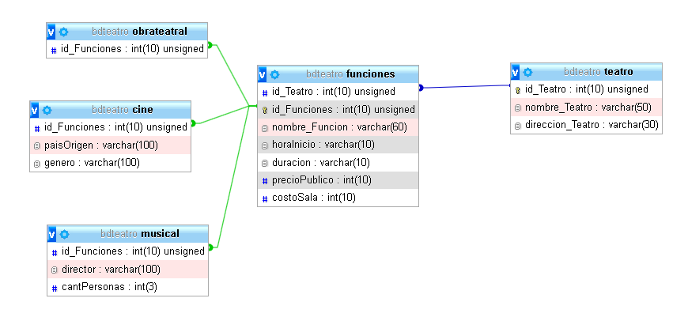

# Este es un trabajo final de IPOO 2021(Introduccion a la Programacion Orientada a Objetos)

## El lenguaje usado fue **PHP 5.4**, IDE Eclipse  y para el servidor local **Xampp**

Este proyecto trata de un Teatro en el cual tiene distintas funciones (actuaciones) de Cine, Musical y Obra teatrales.
El objetivo de este proyecto es poder ver las funciones que estan registradas en un teatro, mostrar datos de las funciones, editar/actualizar datos,
eliminar y que el horario no sea solapado.

---

El teatro tiene como datos:

- idteatro (El id del teatro).
- nombreTeatro (El nombre del teatro).
- direccion (Direccion del teatro).
- arrayFuciones (La coleccion de funciones que tiene el teatro).

Las funciones tienen como datos requeridos:

- objTeatro (Referencia del teatro en el que se encuentra).
- nombre (Nombre de la funcion).
- horaInicio (El horario de inicio de la funcion).
- duracFuncion (La duracion de la funcion).
- precio (El precio).

Luego para cada funcion se le agregan nuevos datos:

Cine:
- genero (Genero de la pelicula).
- origen (Origen de la pelicula).

Musical:

- director (Director del musical).
- cantPersonasEnEscena (La cantidad de personas en Escena).

ObraTeatral:

- No tiene nuevos datos.

---

### Diseño de la Base de Datos

